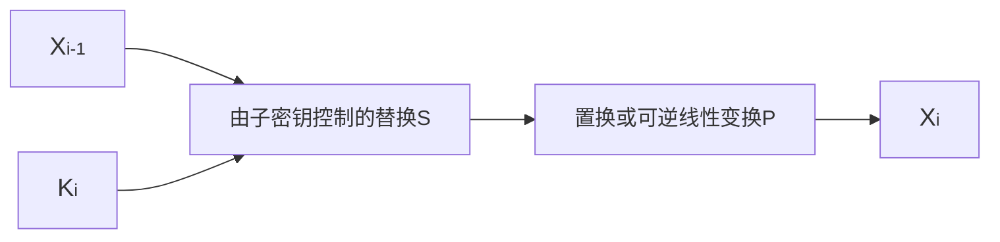

# 简介

分组密码属于对称密码的一种，其特点是加解密都是对明文/密文进行分组后逐组进行加解密。通俗讲就是将明文分块，然后分块加密，解密同理。

分组密码的基本原理：

1. 代换：明文分组到密文分组的可逆变换
2. 扩散：将明文的统计特性散布到密文中去，使得明文的每一位影响密文中多位的值
3. 混淆：使密文和密钥之间的统计关系变得尽可能复杂，使攻击者无法得到密钥，通常使用复杂的代换算法实现

<!-- more -->

分组密码体制基本上都是基于乘积（由一系列代换和置换构成）和迭代来构造的。常见的分组密码结构有[Feistel网络](https://en.wikipedia.org/wiki/Feistel_cipher)和[SP(Substitution Permutation)网络](https://en.wikipedia.org/wiki/Substitution–permutation_network)。DES算法和AES算法分别就是基于Feistel网络和SP网络实现的。

Feistel网络的加密过程为：将明文$x$一分为二，即$x=L_0R_0$，$L_0$是左边的$m$bit，$R_0$是右边的$m$bit，于是对于迭代次数$r$，设$1\le i\le r$，则：

$$\left \{  \begin{array}{c} L_i=R_{i-1} \\  R_i=L_{i-1}\oplus F(R_{i-1},K_i) \end{array} \right.，F为圈函数$$

为了可以利用同一个算法进行加密和解密，Feistel分组密码加密过程的最后一轮没有左右对换。

SP网络主要是对明文进行两项操作：由子密钥控制的替换S、置换或可逆的线性变换P。前者主要起混淆作用，后者主要起扩散作用。

设计分组密码，有以下几个要求：

1. 分组长度$n$要足够大
2. 密钥量要足够大（置换字集中的元素足够多），尽可能消除弱密钥
3. 由密钥确定的置换算法要足够复杂，充分实现扩散和混淆
4. 加解密运算简单，易于实现
5. 数据扩展（一般没有）
6. 差错传播尽可能小

# DES

DES(Data Encryption Standard)是第一个众所周知的分组密码，其分组长度为64bit，密钥长度也为64bit。于1977年1月15日被公布，现已被AES取代。

DES采用Feistel网络进行实现，一共迭代16轮，64bit密钥中包含56bit密钥和8bit奇偶校验位。下图简要介绍了其工作原理：

## 初始置换和逆初始置换

初始置换和逆初始置换在密码方面作用不大，其主要作用是打乱明文ASCII码字划分的关系，打乱各位的次序。



  <table>
  <tbody>
    <tr><th colspan="8">
初始置换
</th></tr>
    <tr><td>  58</td><td>  50</td><td>  42</td><td>  34</td><td>  26</td><td>  18</td><td>  10</td><td>  2</td></tr>
    <tr><td>  60</td><td>  52</td><td>  44</td><td>  36</td><td>  28</td><td>  20</td><td>  12</td><td>  4</td></tr>
    <tr><td>  62</td><td>  54</td><td>  46</td><td>  38</td><td>  30</td><td>  22</td><td>  14</td><td>  6</td></tr>
    <tr><td>  64</td><td>  56</td><td>  48</td><td>  40</td><td>  32</td><td>  24</td><td>  16</td><td>  8</td></tr>
    <tr><td>  57</td><td>  49</td><td>  41</td><td>  33</td><td>  25</td><td>  17</td><td>  9</td><td>  1</td></tr>
    <tr><td>  59</td><td>  51</td><td>  43</td><td>  35</td><td>  27</td><td>  19</td><td>  11</td><td>  3</td></tr>
    <tr><td>  61</td><td>  53</td><td>  45</td><td>  37</td><td>  29</td><td>  21</td><td>  13</td><td>  5</td></tr>
    <tr><td>  63</td><td>  55</td><td>  47</td><td>  39</td><td>  31</td><td>  23</td><td>  15</td><td>  7</td></tr>
  </tbody>
</table>

  <table>
  <tbody>
    <tr><th colspan="8">
逆初始置换
</th></tr>
    <tr><td>40</td><td>8</td><td>48</td><td>16</td><td>56</td><td>24</td><td>64</td><td>32</td></tr>
    <tr><td>39</td><td>7</td><td>47</td><td>15</td><td>55</td><td>23</td><td>63</td><td>31</td></tr>
    <tr><td>38</td><td>6</td><td>46</td><td>14</td><td>54</td><td>22</td><td>62</td><td>30</td></tr>
    <tr><td>37</td><td>5</td><td>45</td><td>13</td><td>53</td><td>21</td><td>61</td><td>29</td></tr>
    <tr><td>36</td><td>4</td><td>44</td><td>12</td><td>52</td><td>20</td><td>60</td><td>28</td></tr>
    <tr><td>35</td><td>3</td><td>43</td><td>11</td><td>51</td><td>19</td><td>59</td><td>27</td></tr>
    <tr><td>34</td><td>2</td><td>42</td><td>10</td><td>50</td><td>18</td><td>58</td><td>26</td></tr>
    <tr><td>33</td><td>1</td><td>41</td><td> 9</td><td>49</td><td>17</td><td>57</td><td>25</td></tr>
  </tbody>
</table>



置换的方法是，将置换表中数字对应位置的值替换原来的值。经过初始置换，明文$X$变为：

$$X^{'}=X^{'}_1 X^{'}_2\cdots X^{'}_{64}=X_{58}X_{50}X_{7}$$

## 迭代变换和圈函数$F$

迭代变换的方式满足Feistel结构：将输入值分为两个32bit块，然后进行对应的变换，一轮变换可以用如下图表示：

迭代变换的关键在于圈函数$F$,而圈函数的参数包含轮密钥$K_i$，所以这个过程的两个关键就是圈函数和轮密钥的生成。

### 轮密钥生成

轮密钥的生成过程如下：

首先将64bit密钥进行选择置换$PC1$去掉8位奇偶校验位并打乱排列顺序，分为左右各28bit的两部分后进行迭代循环左移，每一轮移位的结果再经过选择置换$PC2$后就输出为该轮的轮密钥。

选择置换$PC1$和$PC2$如下：

  <table>
  <tbody>
    <tr><th colspan="7">
选择置换PC_1
</th></tr>
    <tr><td>57</td><td>49</td><td>41</td><td>33</td><td>25</td><td>17</td><td>9</td></tr><tr><td>1</td><td>58</td><td>50</td><td>42</td><td>34</td><td>26</td><td>18</td></tr><tr><td>10</td><td>2</td><td>59</td><td>51</td><td>43</td><td>35</td><td>27</td></tr><tr><td>19</td><td>11</td><td>3</td><td>60</td><td>52</td><td>44</td><td>36</td></tr><tr><td>63</td><td>55</td><td>47</td><td>39</td><td>31</td><td>23</td><td>15</td></tr><tr><td>7</td><td>62</td><td>54</td><td>46</td><td>38</td><td>30</td><td>22</td></tr><tr><td>14</td><td>6</td><td>61</td><td>53</td><td>45</td><td>37</td><td>29</td></tr><tr><td>21</td><td>13</td><td>5</td><td>28</td><td>20</td><td>12</td><td>4</td></tr>
</tbody>
</table>

  <table>
  <tbody>
    <tr><th colspan="6">
选择置换PC_2
</th></tr>
    <tr><td>14</td><td>17</td><td>11</td><td>24</td><td>1</td><td>5</td></tr><tr><td>3</td><td>28</td><td>15</td><td>6</td><td>21</td><td>10</td></tr><tr><td>23</td><td>19</td><td>12</td><td>4</td><td>26</td><td>8</td></tr><tr><td>16</td><td>7</td><td>27</td><td>20</td><td>13</td><td>2</td></tr><tr><td>41</td><td>52</td><td>31</td><td>37</td><td>47</td><td>55</td></tr><tr><td>30</td><td>40</td><td>51</td><td>45</td><td>33</td><td>48</td></tr><tr><td>44</td><td>49</td><td>39</td><td>56</td><td>34</td><td>53</td></tr><tr><td>46</td><td>42</td><td>50</td><td>36</td><td>29</td><td>32</td></tr>
  </tbody>
</table>

循环移位的位数取决于迭代的轮数。在第1、2、9、16轮时循环左移1位，其余情况循环左移2位。

### 圈函数F

圈函数包括4个过程：

1. 位扩展，将输入的32bit扩展为48bit，扩展规则如下：

   

2. 与轮密钥异或

3. 分为8组，每组6bit，经过8个不同的S盒

   S盒是DES中唯一一个非线性部件，输入6bit，输出为4bit，其规则是：输入数据的头尾2bit组合起来作为行选择，中间的4bit组合起来作为列选择，从而可以选到一个4bit的数，并将其输出。

   举例：S盒1输入`011001`，头尾2bit组合为`01`，故选中第二行，中间4bit为`1100`，故选中第13行，对应数字为9，故输出为`1001`。
   
   完整的S盒如下：

    

        <table>
            <tbody>
                <tr><th colspan="16">
S盒1
</th></tr>
                <tr><td>14</td><td>4</td><td>13</td><td>1</td><td>2</td><td>15</td><td>11</td><td>8</td><td>3</td><td>10</td><td>6</td><td>12</td><td>5</td><td>9</td><td>0</td><td>7</td></tr><tr><td>0</td><td>15</td><td>7</td><td>4</td><td>14</td><td>2</td><td>13</td><td>1</td><td>10</td><td>6</td><td>12</td><td>11</td><td>9</td><td>5</td><td>3</td><td>8</td></tr><tr><td>4</td><td>1</td><td>14</td><td>8</td><td>13</td><td>6</td><td>2</td><td>11</td><td>15</td><td>12</td><td>9</td><td>7</td><td>3</td><td>10</td><td>5</td><td>0</td></tr><tr><td>15</td><td>12</td><td>8</td><td>2</td><td>4</td><td>9</td><td>1</td><td>7</td><td>5</td><td>11</td><td>3</td><td>14</td><td>10</td><td>0</td><td>6</td><td>13</td></tr>
            </tbody>
        </table>
    

    

        <table>
            <tbody>
                <tr><th colspan="16">
S盒2
</th></tr>
                <tr><td>15</td><td>1</td><td>8</td><td>14</td><td>6</td><td>11</td><td>3</td><td>4</td><td>9</td><td>7</td><td>2</td><td>13</td><td>12</td><td>0</td><td>5</td><td>10</td></tr><tr><td>3</td><td>13</td><td>4</td><td>7</td><td>15</td><td>2</td><td>8</td><td>14</td><td>12</td><td>0</td><td>1</td><td>10</td><td>6</td><td>9</td><td>11</td><td>5</td></tr><tr><td>0</td><td>14</td><td>7</td><td>11</td><td>10</td><td>4</td><td>13</td><td>1</td><td>5</td><td>8</td><td>12</td><td>6</td><td>9</td><td>3</td><td>2</td><td>15</td></tr><tr><td>13</td><td>8</td><td>10</td><td>1</td><td>3</td><td>15</td><td>4</td><td>2</td><td>11</td><td>6</td><td>7</td><td>12</td><td>0</td><td>5</td><td>14</td><td>9</td></tr>
            </tbody>
        </table>
    

    

        <table>
            <tbody>
                <tr><th colspan="16">
S盒3
</th></tr>
                <tr><td>10</td><td>0</td><td>9</td><td>14</td><td>6</td><td>3</td><td>15</td><td>5</td><td>1</td><td>13</td><td>12</td><td>7</td><td>11</td><td>4</td><td>2</td><td>8</td></tr><tr><td>13</td><td>7</td><td>0</td><td>9</td><td>3</td><td>4</td><td>6</td><td>10</td><td>2</td><td>8</td><td>5</td><td>14</td><td>12</td><td>11</td><td>15</td><td>1</td></tr><tr><td>13</td><td>6</td><td>4</td><td>9</td><td>8</td><td>15</td><td>3</td><td>0</td><td>11</td><td>1</td><td>2</td><td>12</td><td>5</td><td>10</td><td>14</td><td>7</td></tr><tr><td>1</td><td>10</td><td>13</td><td>0</td><td>6</td><td>9</td><td>8</td><td>7</td><td>4</td><td>15</td><td>14</td><td>3</td><td>11</td><td>5</td><td>2</td><td>12</td></tr>
            </tbody>
        </table>
    

    

        <table>
            <tbody>
                <tr><th colspan="16">
S盒4
</th></tr>
                <tr><td>7</td><td>13</td><td>14</td><td>3</td><td>0</td><td>6</td><td>9</td><td>10</td><td>1</td><td>2</td><td>8</td><td>5</td><td>11</td><td>12</td><td>4</td><td>15</td></tr><tr><td>13</td><td>8</td><td>11</td><td>5</td><td>6</td><td>15</td><td>0</td><td>3</td><td>4</td><td>7</td><td>2</td><td>12</td><td>1</td><td>10</td><td>14</td><td>19</td></tr><tr><td>10</td><td>6</td><td>9</td><td>0</td><td>12</td><td>11</td><td>7</td><td>13</td><td>15</td><td>1</td><td>3</td><td>14</td><td>5</td><td>2</td><td>8</td><td>4</td></tr><tr><td>3</td><td>15</td><td>0</td><td>6</td><td>10</td><td>1</td><td>13</td><td>8</td><td>9</td><td>4</td><td>5</td><td>11</td><td>12</td><td>7</td><td>2</td><td>14</td></tr>
            </tbody>
        </table>
    

    

        <table>
            <tbody>
                <tr><th colspan="16">
S盒5
</th></tr>
                <tr><td>2</td><td>12</td><td>4</td><td>1</td><td>7</td><td>10</td><td>11</td><td>6</td><td>5</td><td>8</td><td>3</td><td>15</td><td>13</td><td>0</td><td>14</td><td>9</td></tr><tr><td>14</td><td>11</td><td>2</td><td>12</td><td>4</td><td>7</td><td>13</td><td>1</td><td>5</td><td>0</td><td>15</td><td>13</td><td>3</td><td>9</td><td>8</td><td>6</td></tr><tr><td>4</td><td>2</td><td>1</td><td>11</td><td>10</td><td>13</td><td>7</td><td>8</td><td>15</td><td>9</td><td>12</td><td>5</td><td>6</td><td>3</td><td>0</td><td>14</td></tr><tr><td>11</td><td>8</td><td>12</td><td>7</td><td>1</td><td>14</td><td>2</td><td>13</td><td>6</td><td>15</td><td>0</td><td>9</td><td>10</td><td>4</td><td>5</td><td>3</td></tr>
            </tbody>
        </table>
    

    

        <table>
            <tbody>
                <tr><th colspan="16">
S盒6
</th></tr>
                <tr><td>12</td><td>1</td><td>10</td><td>15</td><td>9</td><td>2</td><td>6</td><td>8</td><td>0</td><td>13</td><td>3</td><td>4</td><td>14</td><td>7</td><td>5</td><td>11</td></tr><tr><td>10</td><td>15</td><td>4</td><td>2</td><td>7</td><td>12</td><td>9</td><td>5</td><td>6</td><td>1</td><td>13</td><td>14</td><td>0</td><td>11</td><td>3</td><td>8</td></tr><tr><td>9</td><td>14</td><td>15</td><td>5</td><td>2</td><td>8</td><td>12</td><td>3</td><td>7</td><td>0</td><td>4</td><td>10</td><td>1</td><td>13</td><td>11</td><td>6</td></tr><tr><td>4</td><td>3</td><td>2</td><td>12</td><td>9</td><td>5</td><td>15</td><td>10</td><td>11</td><td>14</td><td>1</td><td>7</td><td>6</td><td>0</td><td>8</td><td>13</td></tr>
            </tbody>
        </table>
    

    

        <table>
            <tbody>
                <tr><th colspan="16">
S盒7
</th></tr>
                <tr><td>4</td><td>11</td><td>2</td><td>14</td><td>15</td><td>0</td><td>8</td><td>13</td><td>3</td><td>12</td><td>9</td><td>7</td><td>5</td><td>10</td><td>6</td><td>1</td></tr><tr><td>13</td><td>0</td><td>11</td><td>7</td><td>4</td><td>9</td><td>1</td><td>10</td><td>14</td><td>3</td><td>5</td><td>12</td><td>2</td><td>15</td><td>8</td><td>6</td></tr><tr><td>1</td><td>4</td><td>11</td><td>13</td><td>12</td><td>3</td><td>7</td><td>14</td><td>10</td><td>15</td><td>6</td><td>8</td><td>0</td><td>5</td><td>9</td><td>2</td></tr><tr><td>6</td><td>11</td><td>13</td><td>8</td><td>1</td><td>4</td><td>10</td><td>7</td><td>9</td><td>5</td><td>0</td><td>15</td><td>14</td><td>2</td><td>3</td><td>12</td></tr>
            </tbody>
        </table>
    

    

        <table>
            <tbody>
                <tr><th colspan="16">
S盒8
</th></tr>
                <tr><td>13</td><td>2</td><td>8</td><td>4</td><td>6</td><td>15</td><td>11</td><td>1</td><td>10</td><td>9</td><td>3</td><td>14</td><td>5</td><td>0</td><td>12</td><td>7</td></tr><tr><td>1</td><td>15</td><td>13</td><td>8</td><td>10</td><td>3</td><td>7</td><td>4</td><td>12</td><td>5</td><td>6</td><td>11</td><td>0</td><td>14</td><td>9</td><td>2</td></tr><tr><td>7</td><td>11</td><td>4</td><td>1</td><td>9</td><td>12</td><td>14</td><td>2</td><td>0</td><td>6</td><td>10</td><td>13</td><td>15</td><td>3</td><td>5</td><td>8</td></tr><tr><td>2</td><td>1</td><td>14</td><td>7</td><td>4</td><td>10</td><td>8</td><td>13</td><td>15</td><td>12</td><td>9</td><td>0</td><td>3</td><td>5</td><td>6</td><td>11</td></tr>
            </tbody>
        </table>
    

4. 进行置换运算P

   
   

       <table style="display:inline">
           <tbody>
               <tr><th colspan="4">
置换运算P
</th></tr>
               <tr><td>16</td><td>7</td><td>20</td><td>21</td></tr>
               <tr><td>29</td><td>12</td><td>28</td><td>17</td></tr>
               <tr><td>1</td><td>15</td><td>23</td><td>26</td></tr>
               <tr><td>5</td><td>18</td><td>31</td><td>10</td></tr>
               <tr><td>2</td><td>8</td><td>24</td><td>14</td></tr>
               <tr><td>32</td><td>27</td><td>3</td><td>9</td></tr>
               <tr><td>19</td><td>13</td><td>30</td><td>6</td></tr>
               <tr><td>22</td><td>11</td><td>4</td><td>25</td></tr>
           </tbody>
       </table>
   

## DES的解密和安全性

DES的解密过程和加密过程完全相同，唯一的区别是解密使用轮密钥的顺序和加密时相反，即轮密钥使用顺序为$K_{16},K_{15}\cdots K_1$。

DES的安全性完全依赖于所使用的密钥。首先对于现今的计算能力来说，DES的密钥过短，不能抵抗穷举攻击；且DES存在弱密钥，当密钥经过PC1置换后得到的56bit密钥$C_0D_0$满足：$C_0,D_0$分别是$\{00,11,01,10\}$中任意一项的14次重复，那么就有可能存在二次加密导致密文复原的情况。在这之中，$C_0,D_0$分别全为1或全为0的情况共有4种，称为弱密钥；其余称为半弱密钥。

弱密钥的引起的危险很简单，就是每一轮的轮密钥都相同，使用相同密钥加密必定复原密文；半弱密钥则需要成对使用，即找到两个半弱密钥，使得其生成的轮密钥顺序刚好相反，这样同样可以实现复原密文。

弱密钥：`0x0101010101010101`、`0xFEFEFEFEFEFEFEFE`、`0xE0E0E0E0F1F1F1F1`、`0x1F1F1F1F0E0E0E0E`（若不考虑校验位，则`0x0000000000000000`、`0xFFFFFFFFFFFFFFFF`、`0xE1E1E1E1F0F0F0F0`、`0x1E1E1E1E0F0F0F0F`也属于弱密钥）

半弱密钥对：

- `0x011F011F010E010E` 和 `0x1F011F010E010E01`
- `0x01E001E001F101F1` 和 `0xE001E001F101F101`
- `0x01FE01FE01FE01FE` 和 `0xFE01FE01FE01FE01`
- `0x1FE01FE00EF10EF1` 和 `0xE01FE01FF10EF10E`
- `0x1FFE1FFE0EFE0EFE` 和 `0xFE1FFE1FFE0EFE0E`
- `0xE0FEE0FEF1FEF1FE` 和 `0xFEE0FEE0FEF1FEF1`

除此之外，DES还拥有取反特性，这种特性可以使得其在选择明文攻击(Chosen-Plaintext Attack, CPA)下的工作量减半：

$$若C=DESK(M),\space则\bar{C}=DES\bar{K}(\bar{M}),\space\space M为明文，C为密文，K为密钥$$

由于DES的密钥长度不能满足需求，于是有一种多重DES加密的方案增加了密钥长度，被广泛采用的一种是3重DES，其加解密过程如下：

$$y=DES_{k_3}(DES_{k_2}^{-1}(DES_{k_1}(x)))\space(加密),\space\space x=DES_{k_1}^{-1}(DES_{k_2}(DES_{k_3}^{-1}(y)))\space(解密)$$

三重DES的优点在于更换算法的成本小，密钥长度也足够克服穷举攻击（三个密钥互不相同时为168bit，有两个密钥相同时为112bit），但其缺点在于效率更低。

> 参考资料：[DES - Wikipedia](https://en.wikipedia.org/wiki/Data_Encryption_Standard)、[Weak key - Wikipedia](https://en.wikipedia.org/wiki/Weak_key#Weak_keys_in_DES)

# AES

AES(Advanced Encryption Standard)是一种基于SP网络结构的分组密码算法。2001年11月26日，NIST(National Institute of Standards and Technology)正式公布AES，并于2002年5月26日正式生效。

AES的很多运算都是以字节为单位的，所以将一个字节看作是有限域$GF(2^8)$中的一个元素；还有一些运算是以4个字节的字来定义的，所以使用次数小于4、系数在的多项式$GF(2^8)$中的多项式来表示。有限域的运算包含加法、乘法和x乘，其中加法就是逐比特异或，乘法是模乘，即乘法结果需要模去一个8次不可约多项式。

x乘即$x\times a(x)$，把x乘和乘法分开的原因是可以简化运算：若多项式最高位为0，那么x乘结果就为该多项式字节内左移一位的结果；若最高位为1，那么x乘结果为该多项式字节内左移一位后再和$'1b'(00011011)$进行逐比特异或的结果。由于做的是异或运算，所以一些乘法运算也可以通过多次x乘来实现，举例如下：

$$57\times 02=xtime(57)=AE\space\space\space\space 57\times 04=xtime(AE)=47$$
$$57\times 08=xtime(47)=8E\space\space\space\space 57\times 10=xtime(8E)=07$$
$$所以57\times 13=57\times(01\oplus 02\oplus 10)=57\oplus AE\oplus 07=FE$$

AES的分组长度固定为128bit，而密钥可变，对应的加解密轮数也可变：

| AES算法 | 密钥长度 | 分组长度 | 加解密轮数 |
| ------- | -------- | -------- | ---------- |
| AES-128 | 128bit   | 128bit   | 10         |
| AES-192 | 192bit   | 128bit   | 12         |
| AES-256 | 256bit   | 128bit   | 14         |

输入的明文128bit被分为16字节，就可以组成一个4×4的字节矩阵，每一轮都是对这个矩阵进行操作，最终输出的矩阵内容即为密文。

下面以128bit密钥的加解密过程为例。

加密的过程如上图所示。首先是轮密钥加，然后进行10轮的迭代，迭代进行字节替换、行移位、列混合和轮密钥加。到了第10轮时，没有列混合的操作。

解密过程则和加密相似，但是字节替换、行移位和列混合都是加密过程的逆过程，且轮密钥的使用顺序与加密相反。

>  AES的最后一轮迭代没有<b>列混合</b>这个步骤。

## 字节代换

字节代换是一个关于字节的非线性可逆变换，独立的对每个字节进行变换。有两种表示方法：

1. 矩阵表示

   矩阵表示可以这么理解：将一个字节变换成有限域$GF(2^8)$中的乘法逆元（规定$00$映射到$00$），再对其进行一个$GF(2)$上的可逆仿射变换得到。具体运算表示如下：

   $$\begin{pmatrix} y_0\\y_1\\y_2\\y_3\\y_4\\y_5\\y_6\\y_7 \end{pmatrix}=\begin{pmatrix} 1&0&0&0&1&1&1&1\\1&1&0&0&0&1&1&1\\1&1&1&0&0&0&1&1\\1&1&1&1&0&0&0&1\\1&1&1&1&1&0&0&0\\0&1&1&1&1&1&0&0\\0&0&1&1&1&1&1&0\\0&0&0&1&1&1&1&1 \end{pmatrix}\begin{pmatrix} x_0\\x_1\\x_2\\x_3\\x_4\\x_5\\x_6\\x_7 \end{pmatrix}+\begin{pmatrix} 1\\1\\0\\0\\0\\1\\1\\0 \end{pmatrix}$$

   逆过程同样也可以使用矩阵表示，用于解密：

   $$\begin{pmatrix} y_0\\y_1\\y_2\\y_3\\y_4\\y_5\\y_6\\y_7 \end{pmatrix}=\begin{pmatrix} 0&0&1&0&0&1&0&1\\1&0&0&1&0&0&1&0\\0&1&0&0&1&0&0&1\\1&0&1&0&0&1&0&0\\0&1&0&1&0&0&1&0\\0&0&1&0&1&0&0&1\\1&0&0&1&0&1&0&0\\0&1&0&0&1&0&1&0 \end{pmatrix}\begin{pmatrix} x_0\\x_1\\x_2\\x_3\\x_4\\x_5\\x_6\\x_7 \end{pmatrix}\oplus\begin{pmatrix} 1\\1\\0\\0\\0\\1\\1\\0 \end{pmatrix}$$

   >  输入的字节格式为从低位到高位，所以读取结果时要从下往上读。

2. S盒代换

   S盒就是把上面的矩阵运算结果排成了一个表，便于查找和映射。输入的字节高4位作为行值，低4位作为列值，就可以得到对应的代换结果。

    
<table><thead><tr><th colspan="17">S盒</th></tr></thead><thead><tr><th width="50">行/列</th><th width="50">0</th><th width="50">1</th><th width="50">2</th><th width="50">3</th><th width="50">4</th><th width="50">5</th><th width="50">6</th><th width="50">7</th><th width="50">8</th><th width="50">9</th><th width="50">A</th><th width="50">B</th><th width="50">C</th><th width="50">D</th><th width="50">E</th><th width="50">F</th></tr></thead><tbody><tr><th width="50">0</th><td>63</td><td>7c</td><td>77</td><td>7b</td><td>f2</td><td>6b</td><td>6f</td><td>c5</td><td>30</td><td>01</td><td>67</td><td>2b</td><td>fe</td><td>d7</td><td>ab</td><td>76</td></tr><tr><th width="50">1</th><td>ca</td><td>82</td><td>c9</td><td>7d</td><td>fa</td><td>59</td><td>47</td><td>f0</td><td>ad</td><td>d4</td><td>a2</td><td>af</td><td>9c</td><td>a4</td><td>72</td><td>c0</td></tr><tr><th width="50">2</th><td>b7</td><td>fd</td><td>93</td><td>26</td><td>36</td><td>3f</td><td>f7</td><td>cc</td><td>34</td><td>a5</td><td>e5</td><td>f1</td><td>71</td><td>d8</td><td>31</td><td>15</td></tr><tr><th width="50">3</th><td>04</td><td>c7</td><td>23</td><td>c3</td><td>18</td><td>96</td><td>05</td><td>9a</td><td>07</td><td>12</td><td>80</td><td>e2</td><td>eb</td><td>27</td><td>b2</td><td>75</td></tr><tr><th width="50">4</th><td>09</td><td>83</td><td>2c</td><td>1a</td><td>1b</td><td>6e</td><td>5a</td><td>a0</td><td>52</td><td>3b</td><td>d6</td><td>b3</td><td>29</td><td>e3</td><td>2f</td><td>84</td></tr><tr><th width="50">5</th><td>53</td><td>d1</td><td>00</td><td>ed</td><td>20</td><td>fc</td><td>b1</td><td>5b</td><td>6a</td><td>cb</td><td>be</td><td>39</td><td>4a</td><td>4c</td><td>58</td><td>cf</td></tr><tr><th width="50">6</th><td>d0</td><td>ef</td><td>aa</td><td>fb</td><td>43</td><td>4d</td><td>33</td><td>85</td><td>45</td><td>f9</td><td>02</td><td>7f</td><td>50</td><td>3c</td><td>9f</td><td>a8</td></tr><tr><th width="50">7</th><td>51</td><td>a3</td><td>40</td><td>8f</td><td>92</td><td>9d</td><td>38</td><td>f5</td><td>bc</td><td>b6</td><td>da</td><td>21</td><td>10</td><td>ff</td><td>f3</td><td>d2</td></tr><tr><th width="50">8</th><td>cd</td><td>0c</td><td>13</td><td>ec</td><td>5f</td><td>97</td><td>44</td><td>17</td><td>c4</td><td>a7</td><td>7e</td><td>3d</td><td>64</td><td>5d</td><td>19</td><td>73</td></tr><tr><th width="50">9</th><td>60</td><td>81</td><td>4f</td><td>dc</td><td>22</td><td>2a</td><td>90</td><td>88</td><td>46</td><td>ee</td><td>b8</td><td>14</td><td>de</td><td>5e</td><td>0b</td><td>db</td></tr><tr><th width="50">A</th><td>e0</td><td>32</td><td>3a</td><td>0a</td><td>49</td><td>06</td><td>24</td><td>5c</td><td>c2</td><td>d3</td><td>ac</td><td>62</td><td>91</td><td>95</td><td>e4</td><td>79</td></tr><tr><th width="50">B</th><td>e7</td><td>c8</td><td>37</td><td>6d</td><td>8d</td><td>d5</td><td>4e</td><td>a9</td><td>6c</td><td>56</td><td>f4</td><td>ea</td><td>65</td><td>7a</td><td>ae</td><td>08</td></tr><tr><th width="50">C</th><td>ba</td><td>78</td><td>25</td><td>2e</td><td>1c</td><td>a6</td><td>b4</td><td>c6</td><td>e8</td><td>dd</td><td>74</td><td>1f</td><td>4b</td><td>bd</td><td>8b</td><td>8a</td></tr><tr><th width="50">D</th><td>70</td><td>3e</td><td>b5</td><td>66</td><td>48</td><td>03</td><td>f6</td><td>0e</td><td>61</td><td>35</td><td>57</td><td>b9</td><td>86</td><td>c1</td><td>1d</td><td>9e</td></tr><tr><th width="50">E</th><td>e1</td><td>f8</td><td>98</td><td>11</td><td>69</td><td>d9</td><td>8e</td><td>94</td><td>9b</td><td>1e</td><td>87</td><td>e9</td><td>ce</td><td>55</td><td>28</td><td>df</td></tr><tr><th width="50">F</th><td>8c</td><td>a1</td><td>89</td><td>0d</td><td>bf</td><td>e6</td><td>42</td><td>68</td><td>41</td><td>99</td><td>2d</td><td>0f</td><td>b0</td><td>54</td><td>bb</td><td>16</td></tr></tbody></table><table><thead><tr><th colspan="17">逆S盒</th></tr></thead><thead><tr><th width="50">行/列</th><th width="50">0</th><th width="50">1</th><th width="50">2</th><th width="50">3</th><th width="50">4</th><th width="50">5</th><th width="50">6</th><th width="50">7</th><th width="50">8</th><th width="50">9</th><th width="50">A</th><th width="50">B</th><th width="50">C</th><th width="50">D</th><th width="50">E</th><th width="50">F</th></tr></thead><tbody><tr><th width="50">0</th><td>52</td><td>09</td><td>6a</td><td>d5</td><td>30</td><td>36</td><td>a5</td><td>38</td><td>bf</td><td>40</td><td>a3</td><td>9e</td><td>81</td><td>f3</td><td>d7</td><td>fb</td></tr><tr><th width="50">1</th><td>7c</td><td>e3</td><td>39</td><td>82</td><td>9b</td><td>2f</td><td>ff</td><td>87</td><td>34</td><td>8e</td><td>43</td><td>44</td><td>c4</td><td>de</td><td>e9</td><td>cb</td></tr><tr><th width="50">2</th><td>54</td><td>7b</td><td>94</td><td>32</td><td>a6</td><td>c2</td><td>23</td><td>3d</td><td>ee</td><td>4c</td><td>95</td><td>0b</td><td>42</td><td>fa</td><td>c3</td><td>4e</td></tr><tr><th width="50">3</th><td>08</td><td>2e</td><td>a1</td><td>66</td><td>28</td><td>d9</td><td>24</td><td>b2</td><td>76</td><td>5b</td><td>a2</td><td>49</td><td>6d</td><td>8b</td><td>d1</td><td>25</td></tr><tr><th width="50">4</th><td>72</td><td>f8</td><td>f6</td><td>64</td><td>86</td><td>68</td><td>98</td><td>16</td><td>d4</td><td>a4</td><td>5c</td><td>cc</td><td>5d</td><td>65</td><td>b6</td><td>92</td></tr><tr><th width="50">5</th><td>6c</td><td>70</td><td>48</td><td>50</td><td>fd</td><td>ed</td><td>b9</td><td>da</td><td>5e</td><td>15</td><td>46</td><td>57</td><td>a7</td><td>8d</td><td>9d</td><td>84</td></tr><tr><th width="50">6</th><td>90</td><td>d8</td><td>ab</td><td>00</td><td>8c</td><td>bc</td><td>d3</td><td>0a</td><td>f7</td><td>e4</td><td>58</td><td>05</td><td>b8</td><td>b3</td><td>45</td><td>06</td></tr><tr><th width="50">7</th><td>d0</td><td>2c</td><td>1e</td><td>8f</td><td>ca</td><td>3f</td><td>0f</td><td>02</td><td>c1</td><td>af</td><td>bd</td><td>03</td><td>01</td><td>13</td><td>8a</td><td>6b</td></tr><tr><th width="50">8</th><td>3a</td><td>91</td><td>11</td><td>41</td><td>4f</td><td>67</td><td>dc</td><td>ea</td><td>97</td><td>f2</td><td>cf</td><td>ce</td><td>f0</td><td>b4</td><td>e6</td><td>73</td></tr><tr><th width="50">9</th><td>96</td><td>ac</td><td>74</td><td>22</td><td>e7</td><td>ad</td><td>35</td><td>85</td><td>e2</td><td>f9</td><td>37</td><td>e8</td><td>1c</td><td>75</td><td>df</td><td>6e</td></tr><tr><th width="50">A</th><td>47</td><td>f1</td><td>1a</td><td>71</td><td>1d</td><td>29</td><td>c5</td><td>89</td><td>6f</td><td>b7</td><td>62</td><td>0e</td><td>aa</td><td>18</td><td>be</td><td>1b</td></tr><tr><th width="50">B</th><td>fc</td><td>56</td><td>3e</td><td>4b</td><td>c6</td><td>d2</td><td>79</td><td>20</td><td>9a</td><td>db</td><td>c0</td><td>fe</td><td>78</td><td>cd</td><td>5a</td><td>f4</td></tr><tr><th width="50">C</th><td>1f</td><td>dd</td><td>a8</td><td>33</td><td>88</td><td>07</td><td>c7</td><td>31</td><td>b1</td><td>12</td><td>10</td><td>59</td><td>27</td><td>80</td><td>ec</td><td>5f</td></tr><tr><th width="50">D</th><td>60</td><td>51</td><td>7f</td><td>a9</td><td>19</td><td>b5</td><td>4a</td><td>0d</td><td>2d</td><td>e5</td><td>7a</td><td>9f</td><td>93</td><td>c9</td><td>9c</td><td>ef</td></tr><tr><th width="50">E</th><td>a0</td><td>e0</td><td>3b</td><td>4d</td><td>ae</td><td>2a</td><td>f5</td><td>b0</td><td>c8</td><td>eb</td><td>bb</td><td>3c</td><td>83</td><td>53</td><td>99</td><td>61</td></tr><tr><th width="50">F</th><td>17</td><td>2b</td><td>04</td><td>7e</td><td>ba</td><td>77</td><td>d6</td><td>26</td><td>e1</td><td>69</td><td>14</td><td>63</td><td>55</td><td>21</td><td>0c</td><td>7d</td></tr></tbody></table>

   
   下图展示了S盒代换的过程：
   
   

## 行移位

行移位是将输入的矩阵各行进行循环移位，第1行不移动，第2行循环左移1字节，第3行循环左移2字节，第4行循环左移3字节，如下图所示：

解密时则相反，将循环左移改为循环右移即可。

## 列混合

列混合变换是一个替代操作，是AES中最具技巧性的部分，通过矩阵相乘实现，起混淆的效果。本质上就是两个系数在$GF(2^8)$域上的两个小于4次的多项式相乘。

设有多项式$a(x)=a_3x^3+a_2x^2+a_1x+a_0$与$b(x)=b_3x^3+b_2x^2+b_1x+b_0$，多项式的模乘运算记为$\otimes$，设$a(x)\otimes b(x)=c(x)=c_3x^3+c_2x^2+c_1x+c_0$，则显然有：

$$\left \{  \begin{array}{c} c_0=a_0\times b_0\oplus a_3\times b_1\oplus a_2\times b_2\oplus a_1\times b_3\\c_1=a_1\times b_0\oplus a_0\times b_1\oplus a_3\times b_2\oplus a_2\times b_3\\c_2=a_2\times b_0\oplus a_1\times b_1\oplus a_0\times b_2\oplus a_3\times b_3\\c_3=a_3\times b_0\oplus a_2\times b_1\oplus a_1\times b_2\oplus a_0\times b_3\end{array} \right. \space\Longrightarrow\space \begin{pmatrix} c_0\\c_1\\c_2\\c_3 \end{pmatrix}=\begin{pmatrix} a_0&a_3&a_2&a_1\\a_1&a_0&a_3&a_2\\a_2&a_1&a_0&a_3\\a_3&a_2&a_1&a_0 \end{pmatrix}\begin{pmatrix} b_0\\b_1\\b_2\\b_3 \end{pmatrix}$$

可以看见，得到了一个循环矩阵，多项式乘法也就转换成矩阵的乘法。AES选择了一个可逆的固定多项式$d(x)='03'x^3+'01'x^2+'01'x+'02'$，其逆元为$d(x)^{-1}='0B'x^3+'0D'x^2+'09'x+'0E'$，将其作为上面的$a(x)$，将输入的4×4矩阵与其相乘，得到的结果即为列混合的输出。解密使用其逆元进行相乘即可。矩阵表示如下：

$$\begin{bmatrix} 02&03&01&01\\01&02&03&01\\01&01&02&03\\03&01&01&02 \end{bmatrix}\begin{bmatrix} s_{00}&s_{01}&s_{02}&s_{03}\\s_{10}&s_{11}&s_{12}&s_{13}\\s_{20}&s_{21}&s_{22}&s_{23}\\s_{30}&s_{31}&s_{32}&s_{33} \end{bmatrix}=\begin{bmatrix} s^{'}_{00}&s^{'}_{01}&s^{'}_{02}&s^{'}_{03}\\s^{'}_{10}&s^{'}_{11}&s^{'}_{12}&s^{'}_{13}\\s^{'}_{20}&s^{'}_{2
1}&s^{'}_{22}&s^{'}_{23}\\s^{'}_{30}&s^{'}_{31}&s^{'}_{32}&s^{'}_{33} \end{bmatrix}$$

其中，$03\times s_{xy}$可以表示为$(01\oplus 02)\times s_{xy}$，即整个运算可以转换为x乘运算。

整个过程如下图所示：

## 轮密钥加

轮密钥加是最简单的一步，只需将输入矩阵和轮密钥异或即可。

## 密钥扩展

密钥扩展是按字进行的。输入的16字节密钥同样组成一个矩阵，每一列就是一个字，依次被命名为$w[0],w[1],w[2],w[3]$，并基于此生成一个44字的一维线性数组，其中前4个字即为输入的密钥，用于初始密钥加；其余为轮密钥，对应为$w[4:7], w[8:11],\cdots w[36,39],w[40,43]$。

密钥的扩展规则是：对于$w$数组中下标不为4的倍数的元素，只进行简单的异或：$w[i]=w[i-1]\oplus w[i-4]$；而对于下标为4的倍数的元素，则要经过一个复杂过程。

对于下标为4的倍数的元素，首先将$w[i-1]$取出，循环左移一个字节；然后基于上面的S盒进行字节代换；再将得到的结果与轮常量$Rcon[i]$异或；最后和$w[i-4]$异或。轮常量$Rcon[i]$是一个字，这个字的后面3个字节总为0，具体数值如下：

| $i$       | 1          | 2          | 3          | 4          | 5          | 6          | 7          | 8          | 9          | 10         |
| --------- | ---------- | ---------- | ---------- | ---------- | ---------- | ---------- | ---------- | ---------- | ---------- | ---------- |
| $Rcon[i]$ | $01000000$ | $02000000$ | $04000000$ | $08000000$ | $10000000$ | $20000000$ | $40000000$ | $80000000$ | $1b000000$ | $36000000$ |

用一个图来展示扩展过程：

> 参考资料：[AES - Wikipedia](https://en.wikipedia.org/wiki/Advanced_Encryption_Standard)、[Gif来源：Enrique Zabala](http://www.formaestudio.com/rijndaelinspector/)

# SM4

SM4是由我国自主研究设计的商用分组密码算法，与2006年由国家商用密码管理局公开发布，2012年3月被列入国家密码行业标准(GM/T0002-2012)，2016年8月被列入国家标准(GB/T32907-2016)。

SM4同样是一种迭代的分组密码算法，采用的是非平衡的Feistel结构，分组长度和密钥长度都为128bit，采用32轮的非线性迭代。

下图展示了SM4的加密过程，将输入的明文分为4个字$(X_0,X_1,X_2,X_3)$，则每经过一轮迭代，可以生成其后面的一个字，下一次输入即使用最后4个字.例如第一轮可以产生$X_4$，则下一轮的输入即为$(X_1,X_2,X_3,X_4)$，直到最后一轮输出$(X_{32},X_{33},X_{34},X_{35})$，再进行一次反序变换得到$(X_{35},X_{34},X_{33},X_{32})$，即输出为密文。加密变换可以表示如下：

$$X_{i+4}=F(X_i,X_{i+1},X_{i+2},X_{i+3}, rk_i)=X_i\oplus T(X_{i+1}\oplus X_{i+2}\oplus X_{i+3}\oplus rk_i), i=0,1,\cdots,31$$

如图所示，输入的轮密钥表示为$(rk_0,rk_1,rk_2,\cdots,,rk_{30},rk_{31})$，同样是以字为单位。除此之外还有两个以字为单位的参数：系统参数$FK=(FK_0,FK_1,FK_2,FK_3)$和固定参数$CK=(CK_0,CK_1,CK_2,\cdots,CK_{31})$，这两个参数在密钥扩展中会被用到。

SM4的加解密过程是一样的，解密用的轮密钥是加密轮密钥的逆序。

## 轮函数F

$$F(X_i,X_{i+1},X_{i+2},X_{i+3}, rk_i)=X_i\oplus T(X_{i+1}\oplus X_{i+2}\oplus X_{i+3}\oplus rk_i), i=0,1,\cdots,31$$

前面提到SM4采用了非平衡的Feistel结构，其轮函数结构如下图所示：

这种非平衡的结构体现在Feistel结构中的函数$F$中，在这里$F$输入（不包括轮密钥）有3个字，输出为1个字。这样使得每一轮迭代中，输入的3个字和密钥可以扩散到输出的这个字里面，即输出依赖于输入的3个字和密钥。而且，非平衡的Feistel结构由于输入可以是多个分组，也改善了平衡Feistel结构里面分组长度的限制。

接下来是合成置换$T$。$T$是一个合成置换，包括一个非线性变换$\tau$和线性变换$L$。

### 非线性变换*τ*

非线性变换$\tau$由4个并行的S盒构成，即将输入的一个字分为4个字节，并行的输入一个S盒中，再将输出重新拼接为一个字。对于S盒，输入字节的高位作为行选择，低位作为列选择。

<table><thead><tr><th colspan="17">S盒</th></tr></thead><thead><tr><th width="50">行/列</th><th width="50">0</th><th width="50">1</th><th width="50">2</th><th width="50">3</th><th width="50">4</th><th width="50">5</th><th width="50">6</th><th width="50">7</th><th width="50">8</th><th width="50">9</th><th width="50">A</th><th width="50">B</th><th width="50">C</th><th width="50">D</th><th width="50">E</th><th width="50">F</th></tr></thead>
<tbody><tr><th width="50">0</th><td>d6</td><td>90</td><td>e9</td><td>fe</td><td>cc</td><td>e1</td><td>3d</td><td>b7</td><td>16</td><td>b6</td><td>14</td><td>c2</td><td>28</td><td>fb</td><td>2c</td><td>05</td></tr><tr><th width="50">1</th><td>2b</td><td>67</td><td>9a</td><td>76</td><td>2a</td><td>be</td><td>04</td><td>c3</td><td>aa</td><td>44</td><td>13</td><td>26</td><td>49</td><td>86</td><td>06</td><td>99</td></tr><tr><th width="50">2</th><td>9c</td><td>42</td><td>50</td><td>f4</td><td>91</td><td>ef</td><td>98</td><td>7a</td><td>33</td><td>54</td><td>0b</td><td>43</td><td>ed</td><td>cf</td><td>ac</td><td>62</td></tr><tr><th width="50">3</th><td>e4</td><td>b3</td><td>1c</td><td>a9</td><td>c9</td><td>08</td><td>e8</td><td>95</td><td>80</td><td>df</td><td>94</td><td>fa</td><td>75</td><td>8f</td><td>3f</td><td>a6</td></tr><tr><th width="50">4</th><td>47</td><td>07</td><td>a7</td><td>fc</td><td>f3</td><td>73</td><td>17</td><td>ba</td><td>83</td><td>59</td><td>3c</td><td>19</td><td>e6</td><td>85</td><td>4f</td><td>a8</td></tr><tr><th width="50">5</th><td>68</td><td>6b</td><td>81</td><td>b2</td><td>71</td><td>64</td><td>da</td><td>8b</td><td>f8</td><td>eb</td><td>0f</td><td>4b</td><td>70</td><td>56</td><td>9d</td><td>35</td></tr><tr><th width="50">6</th><td>1e</td><td>24</td><td>0e</td><td>5e</td><td>63</td><td>58</td><td>d1</td><td>a2</td><td>25</td><td>22</td><td>7c</td><td>3b</td><td>01</td><td>21</td><td>78</td><td>87</td></tr><tr><th width="50">7</th><td>d4</td><td>00</td><td>46</td><td>57</td><td>9f</td><td>d3</td><td>27</td><td>52</td><td>4c</td><td>36</td><td>02</td><td>e7</td><td>a0</td><td>c4</td><td>c8</td><td>9e</td></tr><tr><th width="50">8</th><td>ea</td><td>bf</td><td>8a</td><td>d2</td><td>40</td><td>c7</td><td>38</td><td>b5</td><td>a3</td><td>f7</td><td>f2</td><td>ce</td><td>f9</td><td>61</td><td>15</td><td>a1</td></tr><tr><th width="50">9</th><td>e0</td><td>ae</td><td>5d</td><td>a4</td><td>9b</td><td>34</td><td>1a</td><td>55</td><td>ad</td><td>93</td><td>32</td><td>30</td><td>f5</td><td>8c</td><td>b1</td><td>e3</td></tr><tr><th width="50">A</th><td>1d</td><td>f6</td><td>e2</td><td>2e</td><td>82</td><td>66</td><td>ca</td><td>60</td><td>c0</td><td>29</td><td>23</td><td>ab</td><td>0d</td><td>53</td><td>4e</td><td>6f</td></tr><tr><th width="50">B</th><td>d5</td><td>db</td><td>37</td><td>45</td><td>de</td><td>fd</td><td>8e</td><td>2f</td><td>03</td><td>ff</td><td>6a</td><td>72</td><td>6d</td><td>6c</td><td>5b</td><td>51</td></tr><tr><th width="50">C</th><td>8d</td><td>1b</td><td>af</td><td>92</td><td>bb</td><td>dd</td><td>bc</td><td>7f</td><td>11</td><td>d9</td><td>5c</td><td>41</td><td>1f</td><td>10</td><td>5a</td><td>d8</td></tr><tr><th width="50">D</th><td>0a</td><td>c1</td><td>31</td><td>88</td><td>a5</td><td>cd</td><td>7b</td><td>bd</td><td>2d</td><td>74</td><td>d0</td><td>12</td><td>b8</td><td>e5</td><td>b4</td><td>b0</td></tr><tr><th width="50">E</th><td>89</td><td>69</td><td>97</td><td>4a</td><td>0c</td><td>96</td><td>77</td><td>7e</td><td>65</td><td>b9</td><td>f1</td><td>09</td><td>c5</td><td>6e</td><td>c6</td><td>84</td></tr><tr><th width="50">F</th><td>18</td><td>f0</td><td>7d</td><td>ec</td><td>3a</td><td>dc</td><td>4d</td><td>20</td><td>79</td><td>ee</td><td>5f</td><td>3e</td><td>d7</td><td>cb</td><td>39</td><td>48</td></tr></tbody>
</table>

### 线性变换L

线性变换$L$就是一个循环移位和异或的过程。设$<<<$表示32bit循环左移，则$L$可以表示为下式：

$$L(B)=B\oplus(B<<<2)\oplus(B<<<10)\oplus(B<<<18)\oplus(B<<<24)$$

## 密钥扩展

SM4中密钥扩展的算法和轮函数有着很大的相似性。

首先将输入的密钥$MK=(MK_0,MK_1,MK_2,MK_3)$与系统参数$FK$进行异或得到中间值$(K_0,K_1,K_2,K_3)$：

$$(K_0,K_1,K_2,K_3)=(MK_0\oplus FK_0,MK_1\oplus FK_1,MK_2\oplus FK_2,MK_3\oplus FK_3)$$

下面是$FK$的具体值：

|  $i$   |    0     |    1     |    2     |    3     |
| :----: | :------: | :------: | :------: | :------: |
| $FK_i$ | a3b1bac6 | 56aa3350 | 677d9197 | b27022dc |

随后就是一个和轮函数差不多的过程：$rk_i=K_{i+4}=K_i\oplus T'(K_{i+1}\oplus K_{i+2}\oplus K_{i+3}\oplus CK_i), i=0,1,\cdots,31$

唯一的区别在于将轮密钥换成了固定参数$CK_i$，且非线性变换$L'(B)=B\oplus(B<<<13)\oplus(B<<<23)$。

系统参数$CK$可以按照以下方法进行取值：

设$ck_{ij}$为$CK_i$的第$j$个字节，则有：$ck_{ij}=(4i+j)\times7(mod256)(i\isin[0,31], j\isin[0,3])$。

下面是$CK$的全部值：

|  $i$   |    0     |    1     |    2     |    3     |
| :----: | :------: | :------: | :------: | :------: |
| $CK_i$ | 00070e15 | 1c232a31 | 383f464d | 545b6269 |
|  $i$   |    4     |    5     |    6     |    7     |
| $CK_i$ | 70777e85 | 8c939aa1 | a8afb6bd | c4cbd2d9 |
|  $i$   |    8     |    9     |    10    |    11    |
| $CK_i$ | e0e7eef5 | fc030a11 | 181f262d | 343b4249 |
|  $i$   |    12    |    13    |    14    |    15    |
| $CK_i$ | 50575e65 | 6c737a81 | 888f969d | a4abb2b9 |
|  $i$   |    16    |    17    |    18    |    19    |
| $CK_i$ | c0c7ced5 | dce3eaf1 | f8ff060d | 141b2229 |
|  $i$   |    20    |    21    |    22    |    23    |
| $CK_i$ | 30373e45 | 4c535a61 | 686f767d | 848b9299 |
|  $i$   |    24    |    25    |    26    |    27    |
| $CK_i$ | a0a7aeb5 | bcc3cad1 | d8dfe6ed | f4fb0209 |
|  $i$   |    28    |    29    |    30    |    31    |
| $CK_i$ | 10171e25 | 2c333a41 | 484f565d | 646b7279 |

# 分组密码的工作模式

## ECB模式

ECB(Electronic Codebook)电码本模式指的是每个明文分组各自独立地进行加密和解密的加密模式，明文分组和密文分组呈一一对应关系。ECB处理短数据时非常理想，但是缺点也非常明显，扩散效果不好，而且在数据重复多的情况下很容易被密码分析者实现分组的代换和重排。

## CBC模式

CBC(Cipher Block Chaining)密文分组链接模式将上一分组的密文输出作为下一分组的输入，先将明文与前一个密文分组进行异或运算，再进行加解密。这种模式需要指定一个初始向量$IV$。

1. 当CBC模式中的密文分组有**一个分组损坏**，只要**密文分组的长度没有发生变化**，解密时**最多会有两个分组受到数据损坏的影响**
2. 当CBC的密文分组中**有一些比特缺失**了，导致密码分组的长度发生变化，此分组发生错位，在**缺失比特位置之后的密文分组也就无法全部解密**

## CFB模式

CFB(Cipher Feedback)密文反馈模式直接将上一分组的**密文**输入加密，再将输出和明文进行异或。利用CFB可以将分组密码转换为一个自同步的流密码。CFB模式的错误传播有限，适合以比特或字节为单位的数据。

## OFB模式

OFB(Output Feedback)输出反馈模式类似于CFB，直接将上一分组的**加密算法输出**加密，再和明文异或得到密文。OFB可以将分组密码转换为一个同步的流密码。OFB的优点在于传输过程的错误不会被传播，但是缺点在于更容易收到消息流的篡改攻击。

## CTR模式

CTR(Counter)计数器模式通过将逐次累加的计数器进行加密来生成密钥流，每个分组对应一个逐次累加的计数器，且每次加密都会生成一个不同的值(Nonce)作为计数器的初始值，且在每次加密时都必须不同。和OFB类似，错误也不会被传播，关键在于Nonce和计数器Counter不能被破坏，否则将导致部分数据无法被恢复。

> 参考资料：[Block cipher mode of operation - Wikipedia](https://en.wikipedia.org/wiki/Block_cipher_mode_of_operation)、https://blog.csdn.net/qq_41137136/article/details/86433998

